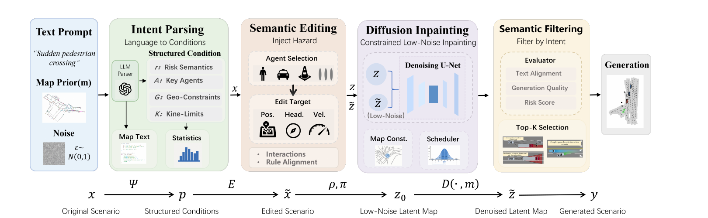

<h1 align="center">NLG-Gen</h1>

<h3 align="center">Natural Language-Guided Generation of Long-Tail Critical Scenarios for Autonomous Driving</h3>

<p align="center">
  <a href="assets/NLG-Gen.pdf"></a>
  <a href="docs/index.html"></a>
  <a href="https://www.python.org/"></a>
  <a href="https://pytorch.org/"></a>
  <a href="LICENSE"></a>
</p>

<p align="center">
  <b>Tingting Lei</b> · Yifan Zhu · Runxi Zhang · Feng Hu · Hong Yu · Ye Wang
</p>

<p align="center">
  NLG-Gen turns natural-language hazard descriptions into controllable, simulator-ready driving scenarios through structured intent parsing, vector-space semantic editing, and constraint-preserving diffusion inpainting.
</p>

---

## Abstract

Long-tail critical scenarios are indispensable for evaluating autonomous-driving safety, but they are rare in real-world logs and difficult to generate with precise control. NLG-Gen first parses a natural-language instruction into executable constraints, then injects the requested interaction by editing structured map and agent elements. A mask-guided, low-noise diffusion stage restores local realism while protecting the edited hazard. Candidate filtering enforces semantic alignment and scenario compliance. Experiments on pedestrian crossing, hard braking, and forced cut-in scenarios show strong controllability and structural validity, while closed-loop evaluation exposes safety weaknesses across three representative planners.

<p align="center">
  
</p>

## Method

| Stage | Role | Paper reference |
| --- | --- | --- |
| **Intent parsing** | Maps free-form text to scenario type, hazard semantics, key agents, geometric constraints, and severity. | Sec. 3.2 |
| **Semantic editing** | Injects explicit pedestrian-crossing, hard-brake, or cut-in interactions in vectorized scenario space. | Sec. 3.3 |
| **Diffusion inpainting** | Repairs edited regions from low-noise latent states using differential and semantic ROI masks. | Sec. 3.4 |
| **Candidate filtering** | Selects simulator-ready outputs using semantic alignment, compliance, and fidelity scores. | Sec. 3.4 |

NLG-Gen is built on [SLEDGE](https://github.com/autonomousvision/sledge) and retains its raster-vector autoencoder, latent diffusion backbone, and nuPlan simulation stack.

## Results

### Generation quality

| Scenario | MPA (%) ↑ | CR (%) ↑ | SQS (%) ↑ | DRL (m) ↑ |
| --- | ---: | ---: | ---: | ---: |
| Pedestrian crossing | **92.66** | **100** | 75.51 | 35.98 |
| Hard braking | 86.93 | **100** | 73.64 | 40.09 |
| Forced cut-in | 83.48 | **100** | **75.57** | **43.57** |

### Severity control

| Severity | MPA (%) ↑ | CR (%) ↑ | SQS (%) ↑ | DRL (m) ↑ |
| --- | ---: | ---: | ---: | ---: |
| Mild | 88.42 | **100** | 73.69 | 36.47 |
| Moderate | 93.93 | **100** | 76.37 | 38.69 |
| Aggressive | **94.42** | **100** | **77.45** | **40.83** |

### Closed-loop challenge

| Planner | nuPlan score (%) ↑ | NLG-Gen score (%) ↑ | Collision-free on NLG-Gen (%) ↑ |
| --- | ---: | ---: | ---: |
| PDM-Closed | 97.61 | 27.86 | 88.75 |
| Diffusion Planner | 95.70 | 18.59 | 69.78 |
| Flow Planner | 97.13 | 10.05 | 58.81 |

The lower scores on NLG-Gen indicate a more challenging safety-evaluation set; they are not intended as planner leaderboard results.

### Stage-wise analysis

| Variant | MPA (%) ↑ | SQS (%) ↑ | Interaction (%) ↑ | CTC (/m) ↓ | RSR (%) ↑ |
| --- | ---: | ---: | ---: | ---: | ---: |
| Original | 29.04 | 76.82 | 50.87 | - | - |
| + Semantic editing | 89.49 | **80.92** | 63.67 | **3.87** | - |
| + Diffusion inpainting | **91.65** | 75.37 | **69.91** | 41.03 | **91.12** |

## Quick start

### Installation

```bash
git clone https://github.com/ALKSMXKQ/sledge0421.git
cd sledge0421
conda env create -f environment.yml
conda activate sledge
pip install -e .
```

Download nuPlan and configure the data, map, experiment, and repository roots as described in [the installation guide](docs/installation.md).

### Build critical scenarios

```bash
python sledge/script/build_multiscenario_raw_cache.py \
  --input-dir "$SLEDGE_EXP_ROOT/caches/autoencoder_cache" \
  --output-root "$SLEDGE_EXP_ROOT/exp/nlg_gen/raw_cache" \
  --config "$NLG_GEN_CONFIG" \
  --glob-pattern "**/sledge_raw.gz" \
  --crossing-ratio 0.20 \
  --cut-in-ratio 0.30 \
  --hard-brake-ratio 0.50
```

### Run constraint-preserving inpainting

```bash
bash scripts/diffusion/half_denoise_from_tiered_cache.sh
```

See [Reproducibility](docs/semantic_control.md) for portable commands, required paths, evaluation, and ablation settings.

## Repository layout

```text
sledge0421/
├── assets/                  # Paper and framework figure
├── docs/                    # Installation, method, and project page
├── scripts/                 # Training, generation, and simulation launchers
├── sledge/
│   ├── semantic_control/    # Language parsing and semantic constraints
│   ├── diffusion/           # Latent diffusion and inpainting
│   ├── simulation/          # Closed-loop simulation
│   └── script/              # Reproducible command-line entry points
├── CITATION.cff
├── environment.yml
└── requirements.txt
```

## Data and checkpoints

The experiments use the public [nuPlan dataset](https://www.nuscenes.org/nuplan) under its original license. Dataset files, cached features, and model checkpoints are not distributed in this repository. The implementation assumes a 64 m × 64 m ego-centric local scene and primarily uses the Boston subset for the reported experiments.

## Citation

```bibtex
@article{lei2026nlggen,
  title   = {NLG-Gen: Natural Language-Guided Generation of Long-Tail Critical Scenarios for Autonomous Driving},
  author  = {Lei, Tingting and Zhu, Yifan and Zhang, Runxi and Hu, Feng and Yu, Hong and Wang, Ye},
  year    = {2026}
}
```

## Acknowledgements

This project builds on [SLEDGE](https://github.com/autonomousvision/sledge). We thank its authors and the nuPlan team for releasing their code and data. This work was supported in part by the National Natural Science Foundation of China and the Natural Science Foundation of Chongqing, as detailed in the paper.

## License

Code is released under the [Apache License 2.0](LICENSE). Third-party datasets, checkpoints, and upstream components remain subject to their respective licenses.
